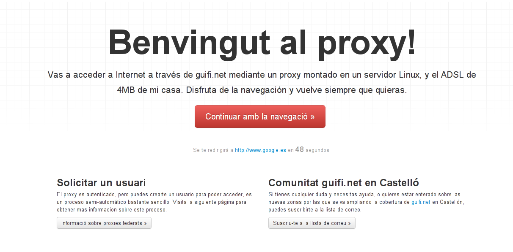

¿Qué es esto?
=============
Es una página web para utilizarla como entrada de tus usuarios al proxy Squid. Todos aquellos que naveguen a través de tu proxy verán esta pantalla primero que nada.

¿Cómo lo configuro?
====================

Necesitas poner este código en un servidor web capaz de interpretar código PHP, normalmente el mismo servidor donde tienes funcionando el servidor Squid.

Luego simplemente es añadir el trozo de código que encontrarás en el archivo squid.conf en el archivo de configuración de Squid (con el mismo nombre).

Ejemplo
=======
Esta es una captura de la página que uso yo en mi proxy.

